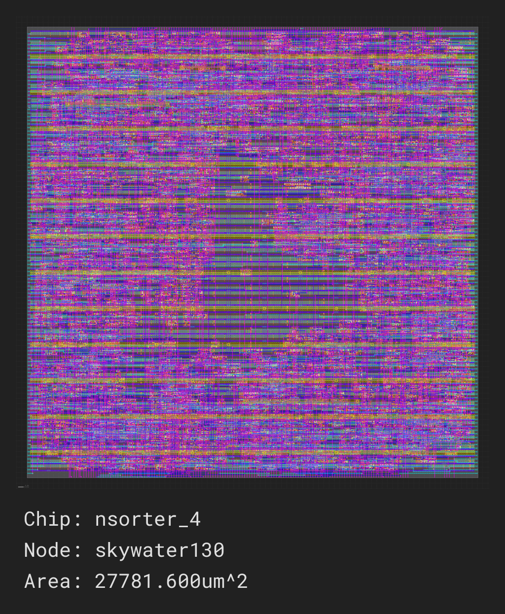

# Minimal Latency N-Sorter (MLNS)

This repo contains MLNS for small values of N, as well as the generator used to generate them.

A **N-sorter** is a circuit that, given N input values, returns them sorted.
A 2-sorter, commonly used in [sorting networks][SN], is a special case of N-sorter.

A **MLNS** is an N-sorter that aims at ensuring that the sorting happens with the smallest
possible latency. Specifically, the latency virtually does not depend on the number of inputs N,
as all comparisons are done in parallel (instead of in serial stages like they are done in
sorting networks).

## Generator

To generate the N-sorter for a specifc value of `N`, run: `ruby mlnsgen/mlnsgen.rb <N>` (e.g. `ruby mlnsgen/mlnsgen.rb 4`).
The current algorithm is pretty dumb, so it is too slow for values of N much higher than 8 (and furthermore the resulting
Verilog code that implements such wide N-sorters becomes impractically large for synthesis tools to handle efficiently).

## Generated sorters

The files `nsorter_*.v` contain the generated n-sorters.

Just to provide a rough idea, using [Yosys][Y] `synth` we get the following gate counts (for 64 bit values):

|   N |  Gates |
| --: | -----: |
|   2 |    447 |
|   3 |   1736 |
|   4 |   3543 |
|   5 |   6366 |
|   6 |  12551 |
|   7 |  41387 |
|   8 | 250448 |

SiliconCompiler yields the following for the 4-sorter:

## License

[MIT](LICENSE)

[SN]: https://en.wikipedia.org/wiki/Sorting_network
[Y]: https://yosyshq.net/yosys/
